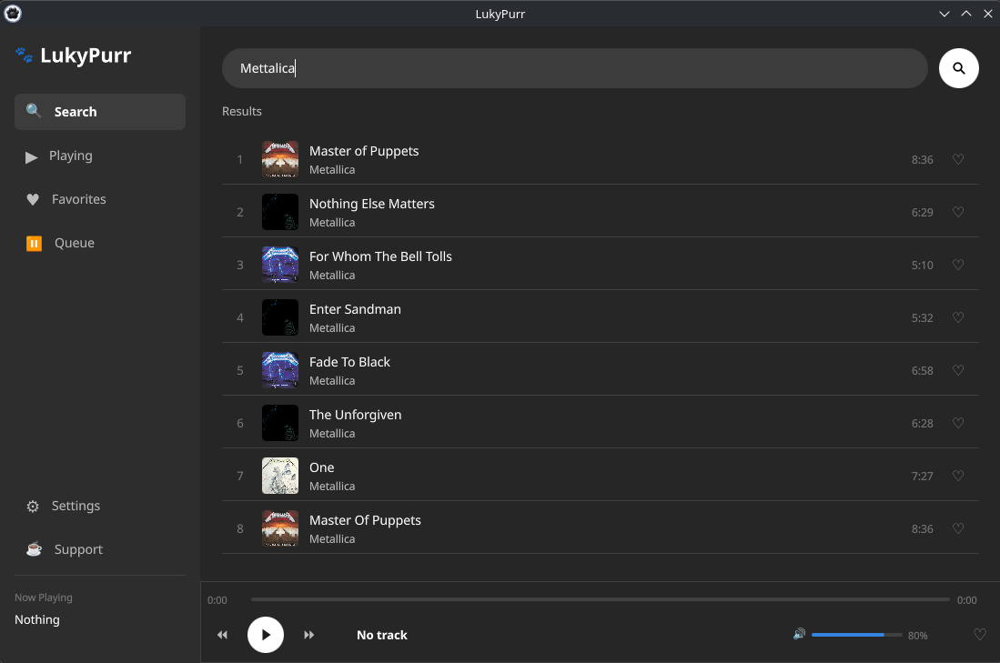
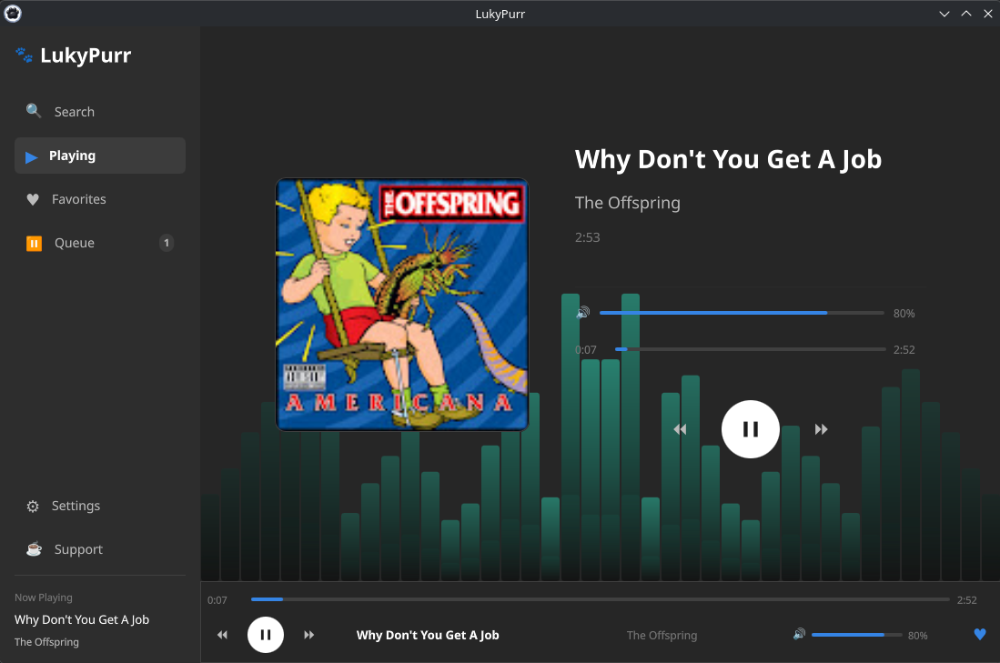
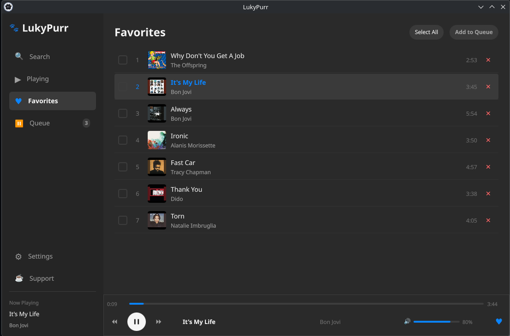

# 🐱 LukyPurr – Music Player

LukyPurr is a modern and open-source music player built with Python and Qt/QML.
It features a clean and elegant interface and streams music from YouTube Music through an **unofficial integration**, focusing on a smooth and visually pleasing listening experience.

---

## ✨ Features

* 🎧 Stream music directly from YouTube Music (unofficial)
* 🎨 Modern and beautiful UI built with Qt/QML
* 🌙 Theme system
* ❤️ Favorites system
* ⏯️ Playback controls (play, pause, next, previous)
* 📀 Displays album cover and track info
* 🔀 Automatic playlist generation based on current music
* 📊 Audio spectrum visualizer (FFT-based)
* 🖥️ Cross-platform (Linux & Windows)
* 📌 System tray integration (play, pause, next, exit)

---

## 🖼️ Preview
* Search Screen


* Play Screen



* Favorite music Screen

## 🚀 Installation

### ⚠️ Requirements

* Python 3.14+
* pip

Make sure Python is installed and available in your system PATH before running the scripts.

---

### Clone the repository

```bash
git clone https://github.com/your-username/lukypurr-music-player.git
cd lukypurr-music-player
```

---

### Install dependencies

```bash
pip install -r requirements.txt
```

---

### Run the application

```bash
python main.py
```

---

## 🛠️ Build & Installation (Automatic Scripts)

LukyPurr provides simple build scripts to make installation easy on both Linux and Windows.

These scripts will automatically:

* Create a Python virtual environment (venv)
* Install all required dependencies using pip
* Compile the application into a standalone executable

---

### 🐧 Linux

Run the following command:

```bash
./build.sh
```

---

### 🪟 Windows

Run:

```bat
build.bat
```

---

### ⚙️ What these scripts do

Both scripts perform the following steps:

1. Create an isolated Python environment (venv)
2. Install dependencies from `requirements.txt`
3. Build the application into an executable

This ensures:

* No conflicts with system Python packages
* Reproducible builds
* Easy setup for end users

---

### 📦 Output

After the build process, the executable will be available in the output directory (e.g. `dist/`).

---

### 💡 Tip

On Linux, if the script is not executable, run:

```bash
chmod +x build.sh
```


## ⚠️ Disclaimer

This project uses an **unofficial method** to access and stream music from YouTube Music.

* This project is **not affiliated with, endorsed by, or supported by Google or YouTube**
* It is intended for **educational and personal use only**


---

## 🐾 About Luky

Luky is the inspiration behind this project — a curious little cat who loves music 🐱.

---

## 🛠️ Technologies Used

* Python
* Qt / QML (PySide6)
* NumPy (audio processing)
* yt-dlp (stream extraction)

---

## 📜 License

This project is licensed under the MIT License.
See the [LICENSE](LICENSE) file for details.

---

## ⭐ Contributing

Contributions are welcome!

Feel free to:

* Open issues
* Suggest features
* Submit pull requests

---
